# COACHTECH フリマアプリ
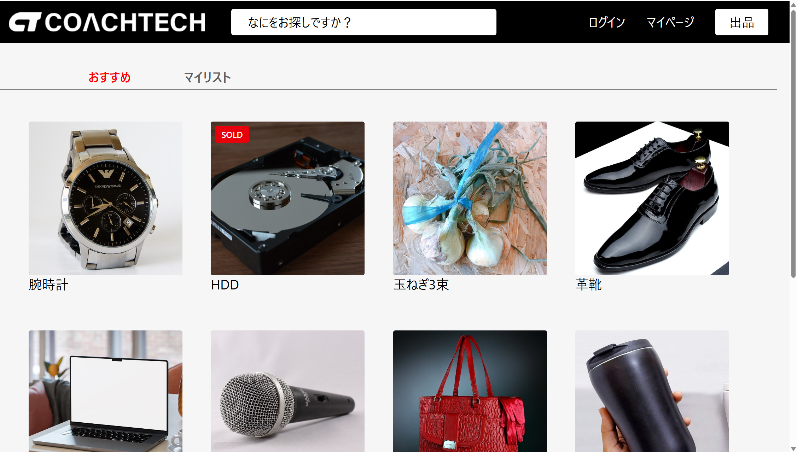

## アプリケーション概要
COACHTECH模擬案件として開発したフリマアプリです。
会員登録・商品出品・商品購入・コメント・いいねなど、フリマサービスに必要な基本機能を実装しています。
Laravel Fortifyによるメール認証、Stripe Checkoutを利用したカード・コンビニ決済を導入し、
主要機能についてFeatureテストを実装して品質を担保しています。

## 主な機能
### 認証
- 会員登録
- メール認証
- ログイン・ログアウト
### 商品
- 商品一覧表示
- 商品検索
- 商品詳細表示
- 商品出品
### 購入
- Stripe決済（カード・コンビニ）
- 配送先変更
- 商品購入
### コミュニケーション
- いいね
- コメント
### ユーザー
- プロフィール表示・編集

## 使用技術（実行環境）
| 分類 | 技術 |
|------|------|
| Backend | PHP 8.5 / Laravel 10 |
| Frontend | Blade / Tailwind CSS / Vite |
| Database | MySQL 8 |
| Infrastructure | Docker / Laravel Sail |
| Authentication | Laravel Fortify |
| Payment | Stripe Checkout |
| Mail | MailHog |
| Version Control | Git / GitHub |

## ER図
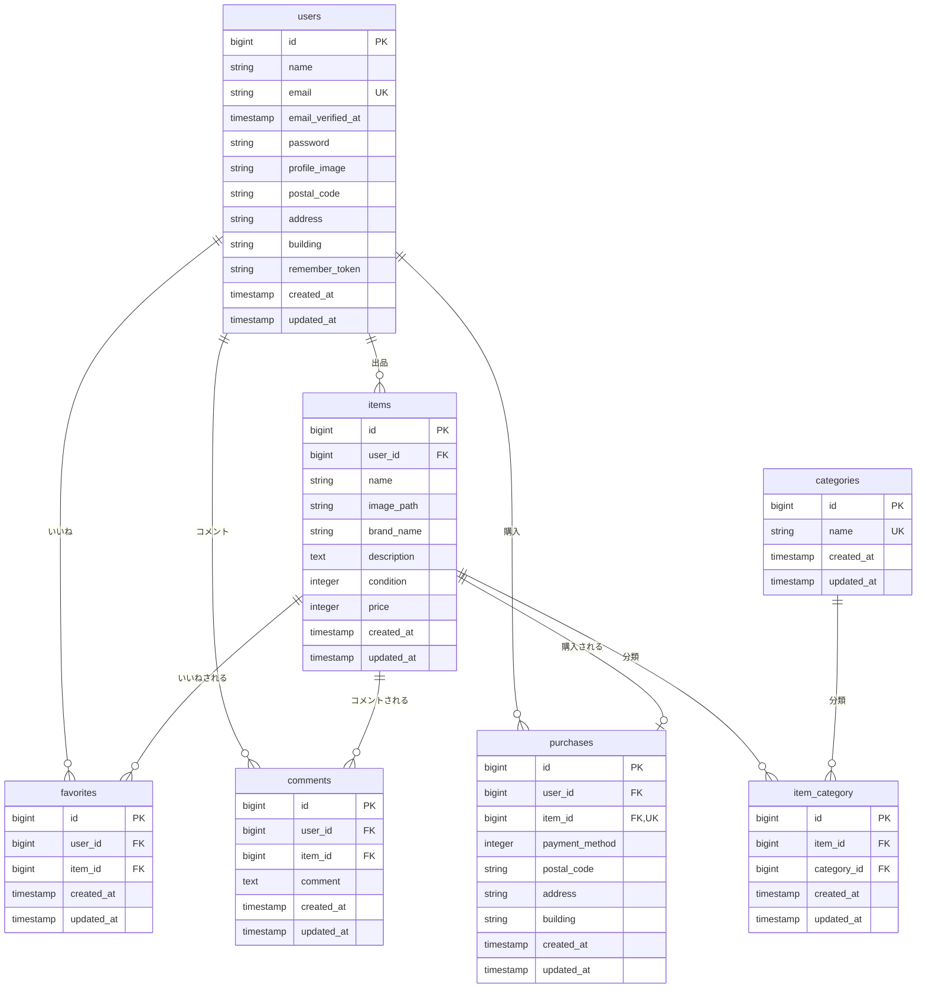

## 画面一覧
### 画面遷移

| 画面名称 | パス | HTTPメソッド | Controller | Action | 認証 | 説明 |
|:---------|:-----|:------------:|:-----------|:-------|:----:|:-----|
| 商品一覧画面（トップ画面） | `/` | GET | `ItemController` | `index` | 不要 | 商品一覧ページ |
| 商品一覧画面（マイリスト） | `/?tab=mylist` | GET | `ItemController` | `index` | 不要 | マイリストページ |
| 会員登録画面 | `/register` | GET | `RegisteredUserController` | `create` | 不要 | 会員登録ページ |
| ログイン画面 | `/login` | GET | `AuthenticatedSessionController` | `create` | 不要 | ログインページ |
| 商品詳細画面 | `/item/{item_id}` | GET | `ItemController` | `show` | 不要 | 商品詳細ページ |
| 商品購入画面 | `/purchase/{item_id}` | GET | `PurchaseController` | `show` | 必要 | 商品購入ページ |
| 住所変更画面 | `/purchase/address/{item_id}` | GET | `PurchaseAddressController` | `edit` | 必要 | 配送先住所変更ページ |
| 商品出品画面 | `/sell` | GET | `ItemController` | `create` | 必要 | 商品出品ページ |
| プロフィール画面 | `/mypage` | GET | `ProfileController` | `index` | 必要 | プロフィールページ |
| プロフィール編集画面 | `/mypage/profile` | GET | `ProfileController` | `edit` | 必要 | プロフィール編集ページ |
| プロフィール画面（購入商品一覧） | `/mypage?page=buy` | GET | `ProfileController` | `index` | 必要 | 購入した商品の一覧を表示 |
| プロフィール画面（出品商品一覧） | `/mypage?page=sell` | GET | `ProfileController` | `index` | 必要 | 出品した商品の一覧を表示 |

### View

| 画面名称 | Bladeファイル |
|:---------|:-------------|
| 商品一覧画面（トップ画面） | `resources/views/item/index.blade.php` |
| 会員登録画面 | `resources/views/auth/register.blade.php` |
| ログイン画面 | `resources/views/auth/login.blade.php` |
| メール認証画面 | `resources/views/auth/verify-email.blade.php` |
| 商品詳細画面 | `resources/views/item/show.blade.php` |
| 商品購入画面 | `resources/views/purchase/show.blade.php` |
| 住所変更画面 | `resources/views/purchase/address.blade.php` |
| 商品出品画面 | `resources/views/item/sell.blade.php` |
| プロフィール画面 | `resources/views/mypage/index.blade.php` |
| プロフィール編集画面 | `resources/views/mypage/profile.blade.php` |

## スクリーンショット
### 商品一覧画面(トップ画面)_マイリスト
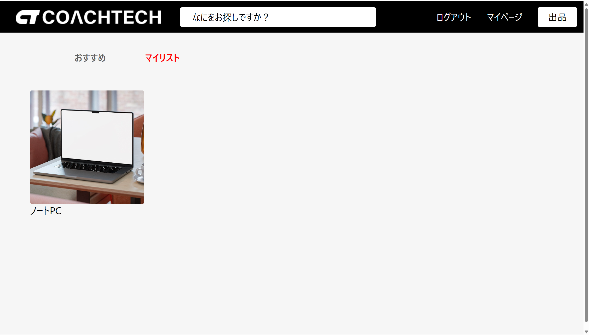

### 会員登録
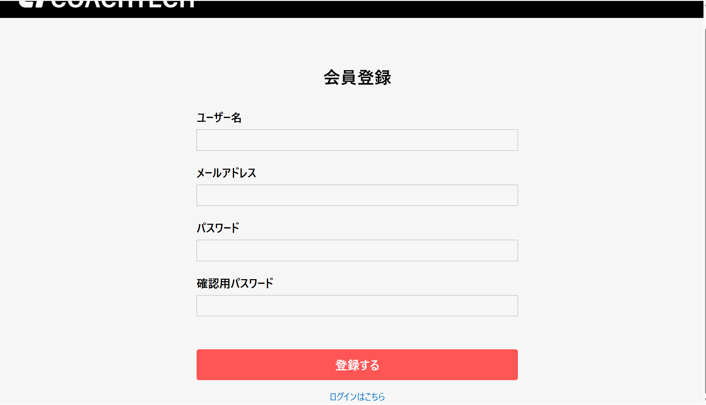

### ログイン画面
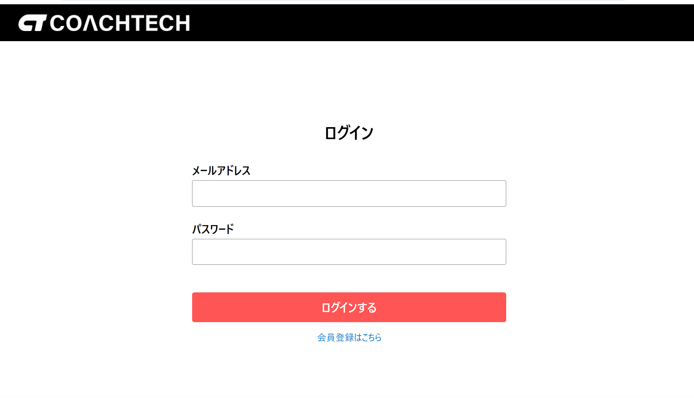

### 商品詳細画面
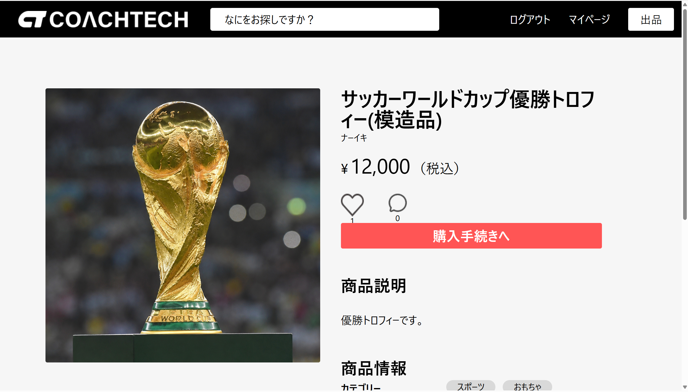

### 商品購入画面
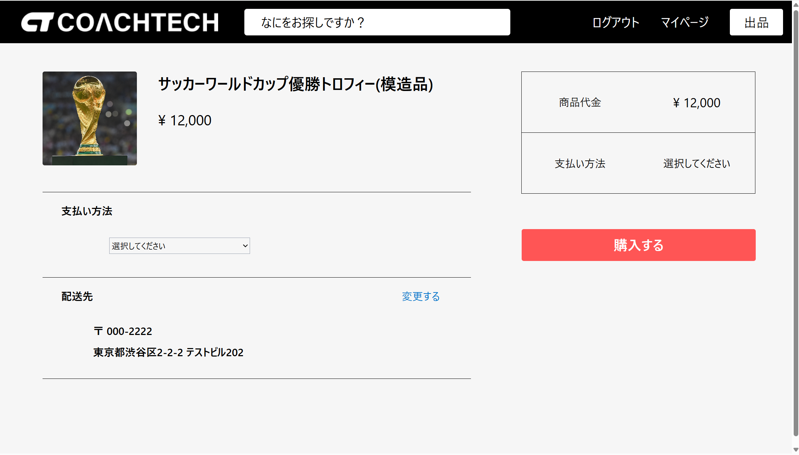

### 住所変更画面
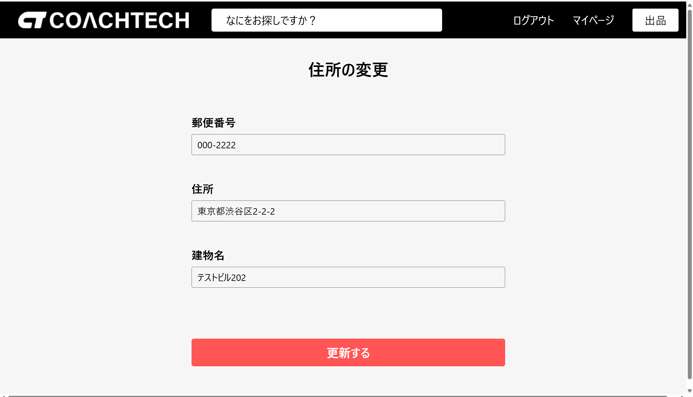

### 商品出品画面
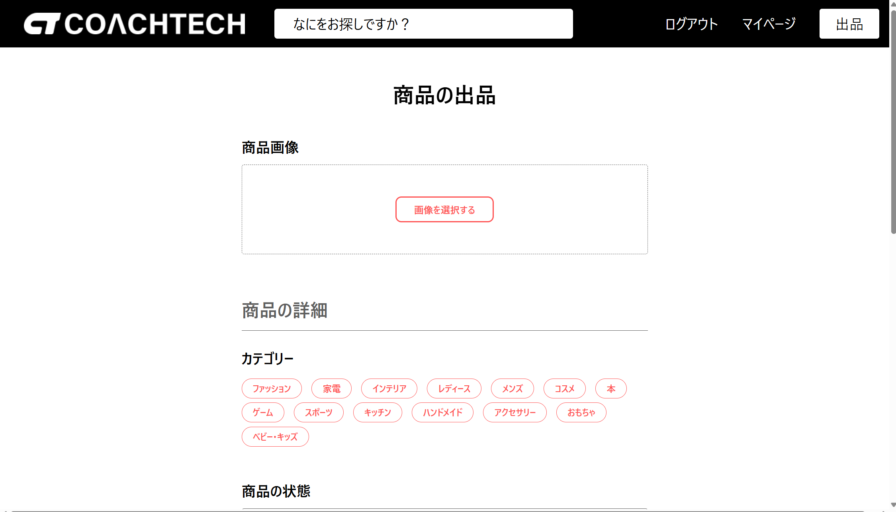

### プロフィール編集画面
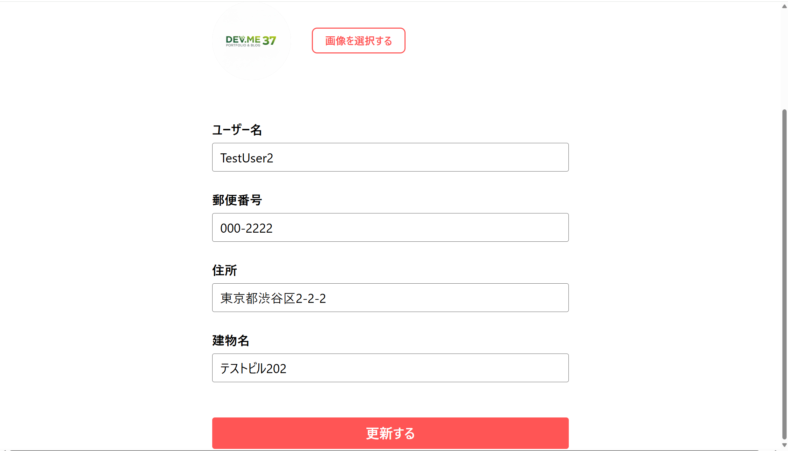

### プロフィール画面_購入した商品一覧
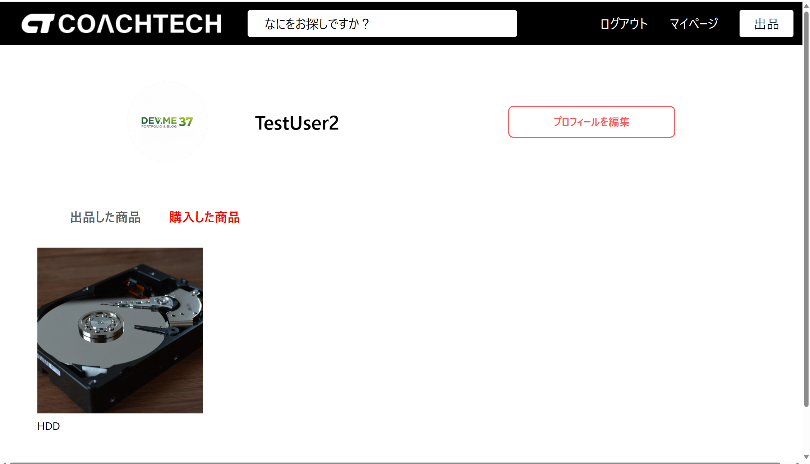

### プロフィール画面_出品した商品一覧
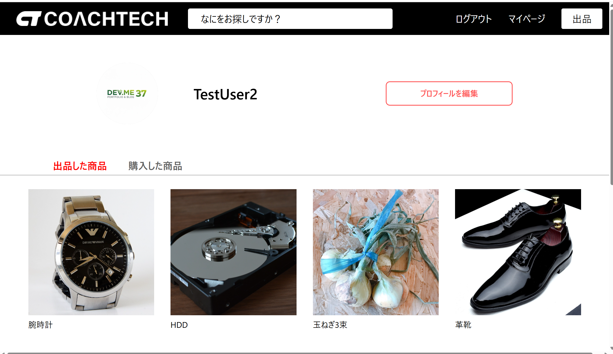

### メール認証画面
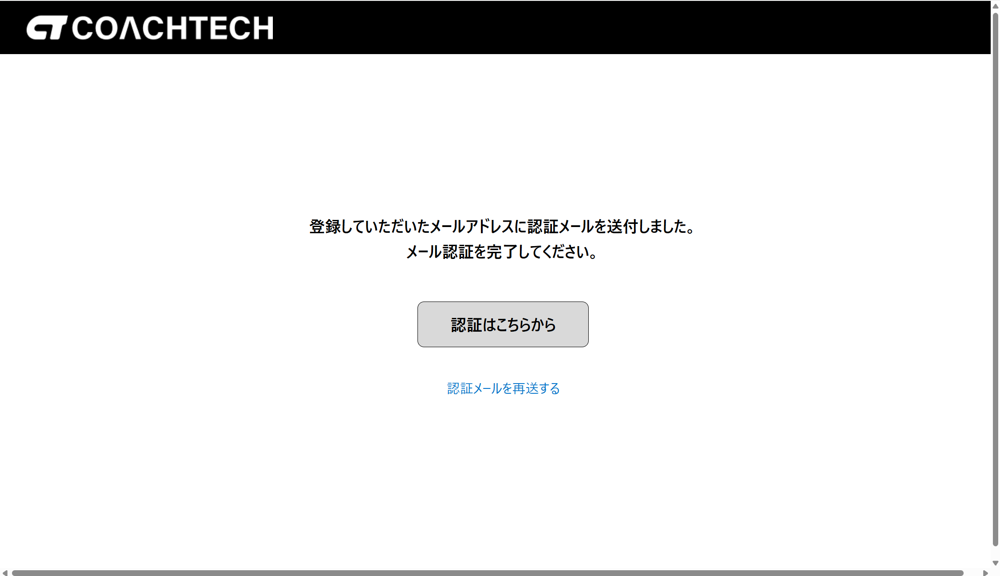


## 環境構築
### 1. リポジトリをクローン
```bash
git clone <リポジトリURL>
cd flea-market-app
```
### 2. 環境変数ファイルを作成
```bash
cp .env.example .env
```
### 3. Dockerコンテナを起動
```bash
./vendor/bin/sail up -d --build
```
※ `vendor` ディレクトリがない場合は、先に以下を実行してください。
```bash
docker run --rm \
  -u "$(id -u):$(id -g)" \
  -v "$(pwd):/var/www/html" \
  -w /var/www/html \
  laravelsail/php82-composer:latest \
  composer install --ignore-platform-reqs
```
### 4. アプリケーションキーを作成
```bash
./vendor/bin/sail artisan key:generate
```
### 5. マイグレーションを実行
```bash
./vendor/bin/sail artisan migrate
```
### 6. 初期データを投入する場合
```bash
./vendor/bin/sail artisan db:seed
```
または、マイグレーションとシーディングをまとめて実行する場合は以下です。
```bash
./vendor/bin/sail artisan migrate:fresh --seed
```
### 7. ストレージリンクを作成
```bash
./vendor/bin/sail artisan storage:link
```

## URL
| サービス | URL |
|----------|-----|
| アプリ | http://localhost |
| MailHog | http://localhost:8025 |

## テスト
主要機能について41件のFeatureテストを実装しています。
```bash
./vendor/bin/sail artisan test
```
### テスト対象
- 会員登録
- メール認証
- ログイン・ログアウト
- 商品一覧
- 商品検索
- 商品詳細
- いいね
- コメント
- 商品購入
- 配送先変更
- プロフィール
- 商品出品

## ディレクトリ構成
```text
flea-market-app/
├── app/
│   ├── Actions/
│   │   └── Fortify/
│   ├── Http/
│   │   ├── Controllers/
│   │   └── Requests/
│   ├── Models/
│   └── Providers/
├── database/
│   ├── factories/
│   ├── migrations/
│   └── seeders/
├── public/
│   └── img/
├── resources/
│   ├── css/
│   ├── js/
│   └── views/
│       ├── auth/
│       ├── item/
│       ├── layouts/
│       ├── mypage/
│       └── purchase/
├── routes/
│   └── web.php
├── storage/
│   └── app/
│       └── public/
├── tests/
│   ├── Feature/
│   │   ├── Auth/
│   │   ├── Item/
│   │   ├── Purchase/
│   │   ├── Sell/
│   │   └── User/
│   └── Unit/
├── docker-compose.yml
├── composer.json
├── package.json
└── README.md
```
## 技術的な工夫
- Laravel Fortifyによる認証・メール認証の導入
- Stripe Checkoutによるカード・コンビニ決済
- FormRequestを利用してバリデーションを責務分離
- Eloquentリレーションを利用したデータ取得
- Factory・Seederを利用したテストデータ生成
- Featureテストによる主要機能の自動テスト
- リクエストバリデーションによる入力チェック

## 今後の改善点
- お気に入り商品の並び替え
- 商品画像の複数枚登録
- 管理者機能
- 通知機能
- E2Eテスト（Laravel DuskやPlaywright）の導入

## 学習ポイント
- Laravel Fortifyを利用した認証機能
- Stripe APIとの連携
- Eloquentリレーション設計
- Featureテストによる品質保証

## 作者
**氏名**
西海　顕一郎

**GitHub Profile**
https://github.com/ks8810as5086-ui

**Repository**
[COACHTECH フリマアプリ](https://github.com/ks8810as5086-ui/flea-market-app)
